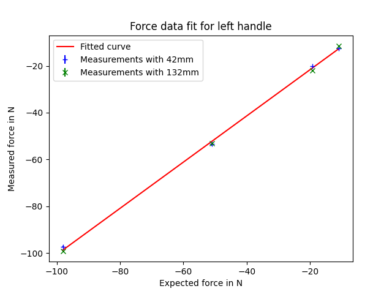
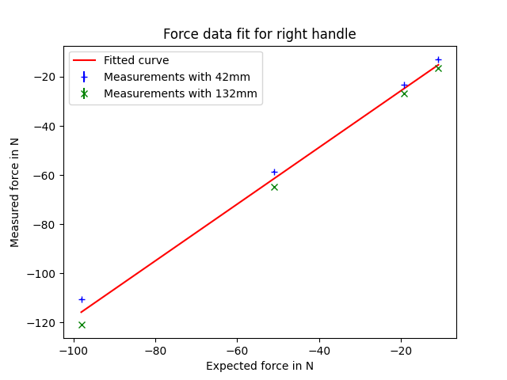

# Forces left

| Weight | Weight measured | Distance | Measured Force w/o weight | Measured Force w/ weight | Calculated weight |
|-|-|-|-|-|-|
| 1kg | 1.1kg | 42mm | -3.42 ± 5.19 N | -12.49 ± 0.06 N | 1.27 kg |
| 2kg | 1.95kg | 42mm | -0.06 ± 0.28 N | -20.14 ± 0.05 N | 2.05 kg |
| 5kg | 5.2kg | 42mm | -0.09 ± 0.43 N | -53.47 ± 0.63 N | 5.45 kg |
| 10kg | 10.0kg | 42mm | -0.09 ± 0.12 N | -97.36 ± 0.09 N | 9.92 kg |
| 1kg | 1.1kg | 132mm | -0.83 ± 1.93 N | -11.35 ± 0.04 N | 1.16 kg |
| 2kg | 1.95kg | 132mm | -0.05 ± 0.10 N | -21.82 ± 0.07 N | 2.22 kg |
| 5kg | 5.2kg | 132mm | -0.46 ± 1.24 N | -53.09 ± 0.22 N | 5.41 kg |
| 10kg | 10.0kg | 132mm | -0.69 ± 1.77 N | -99.22 ± 0.39 N | 10.11 kg |

# Forces right

| Weight | Weight measured | Distance | Measured Force w/o weight | Measured Force w/ weight | Calculated weight |
|-|-|-|-|-|-|
| 1kg | 1.1kg | 42mm | 0.04 ± 0.08 N | -12.78 ± 0.06 N | 1.30 kg |
| 2kg | 1.95kg | 42mm | -1.40 ± 2.14 N | -23.35 ± 0.08 N | 2.38 kg |
| 5kg | 5.2kg | 42mm | -0.01 ± 0.06 N | -58.61 ± 0.08 N | 5.97 kg |
| 10kg | 10.0kg | 42mm | -0.11 ± 0.07 N | -110.54 ± 0.14 N | 11.27 kg |
| 1kg | 1.1kg | 132mm | -0.10 ± 0.15 N | -16.53 ± 0.06 N | 1.68 kg |
| 2kg | 1.95kg | 132mm | -0.11 ± 0.38 N | -26.88 ± 0.07 N | 2.74 kg |
| 5kg | 5.2kg | 132mm | -0.35 ± 1.13 N | -64.80 ± 0.18 N | 6.61 kg |
| 10kg | 10.0kg | 132mm | 0.14 ± 5.81 N | -120.90 ± 0.14 N | 12.32 kg |

# Force data fit

Linear regression on the function `y(x) = a * x + b` with least squares on the force data of the handles.

Results:
|Handle|a|b|
|-|-|-|
|left|0.987|-1.946|
|right|1.154|-2.658|

Plotted data of the handles including the fit:

| Left handle | Right handle |
|-|-|
|  |  |

# Torques left

| Weight | Weight measured | Distance | Expected torque | Measured torque w/ weight | Measured torque w/o weight |
|-|-|-|-|-|-|
| 1kg | 1.1kg | 42mm | 0.4532 Nm | -0.4100 ± 0.0017 Nm | -0.1355 ± 0.1923 Nm |
| 2kg | 1.95kg | 42mm | 0.8034 Nm | -0.9084 ± 0.0036 Nm | -0.0032 ± 0.0116 Nm |
| 5kg | 5.2kg | 42mm | 2.1425 Nm | -2.2620 ± 0.0551 Nm | -0.0087 ± 0.0162 Nm |
| 10kg | 10.0kg | 42mm | 4.1202 Nm | -4.7958 ± 0.0083 Nm | -0.0003 ± 0.0152 Nm |
| 1kg | 1.1kg | 132mm | 1.4244 Nm | -1.4673 ± 0.0047 Nm | -0.0770 ± 0.1664 Nm |
| 2kg | 1.95kg | 132mm | 2.5251 Nm | -2.5106 ± 0.0024 Nm | -0.0055 ± 0.0154 Nm |
| 5kg | 5.2kg | 132mm | 6.7336 Nm | -6.6281 ± 0.0104 Nm | -0.0801 ± 0.1318 Nm |
| 10kg | 10.0kg | 132mm | 12.9492 Nm | -12.9658 ± 0.0254 Nm | 0.0440 ± 0.1777 Nm |

# Torques right

| Weight | Weight measured | Distance | Expected torque | Measured torque w/ weight | Measured torque w/o weight |
|-|-|-|-|-|-|
| 1kg | 1.1kg | 42mm | 0.4532 Nm | -0.4466 ± 0.0048 Nm | 0.0002 ± 0.0038 Nm |
| 2kg | 1.95kg | 42mm | 0.8034 Nm | -0.7456 ± 0.0050 Nm | -0.0372 ± 0.0625 Nm |
| 5kg | 5.2kg | 42mm | 2.1425 Nm | -2.0338 ± 0.0067 Nm | 0.0000 ± 0.0000 Nm |
| 10kg | 10.0kg | 42mm | 4.1202 Nm | -4.1663 ± 0.0146 Nm | 0.0089 ± 0.0031 Nm |
| 1kg | 1.1kg | 132mm | 1.4244 Nm | -1.2886 ± 0.0034 Nm | 0.0006 ± 0.0102 Nm |
| 2kg | 1.95kg | 132mm | 2.5251 Nm | -2.4359 ± 0.0049 Nm | -0.0066 ± 0.0302 Nm |
| 5kg | 5.2kg | 132mm | 6.7336 Nm | -6.2749 ± 0.0100 Nm | -0.0308 ± 0.1163 Nm |
| 10kg | 10.0kg | 132mm | 12.9492 Nm | -12.3407 ± 0.0055 Nm | 0.0904 ± 0.4318 Nm |
